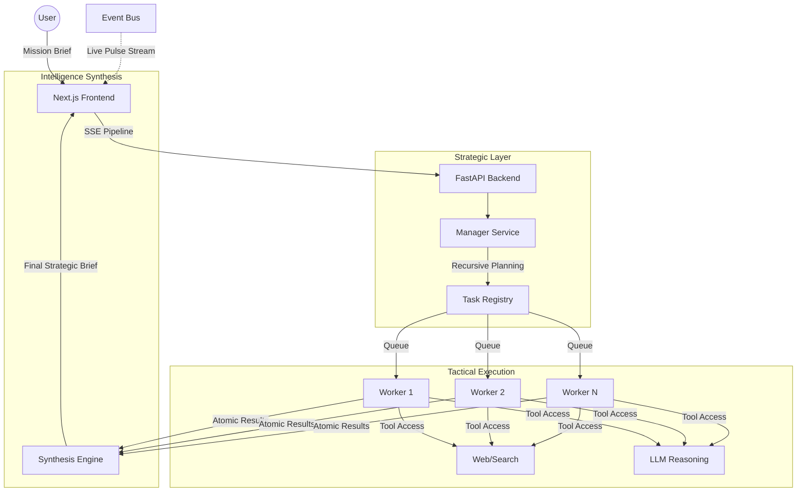
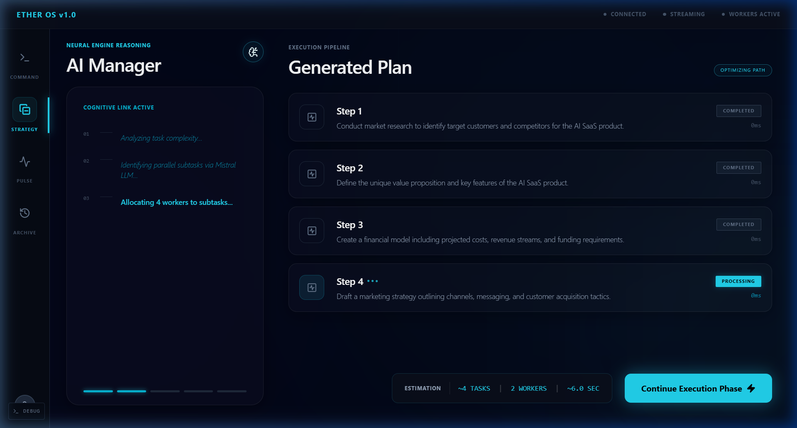
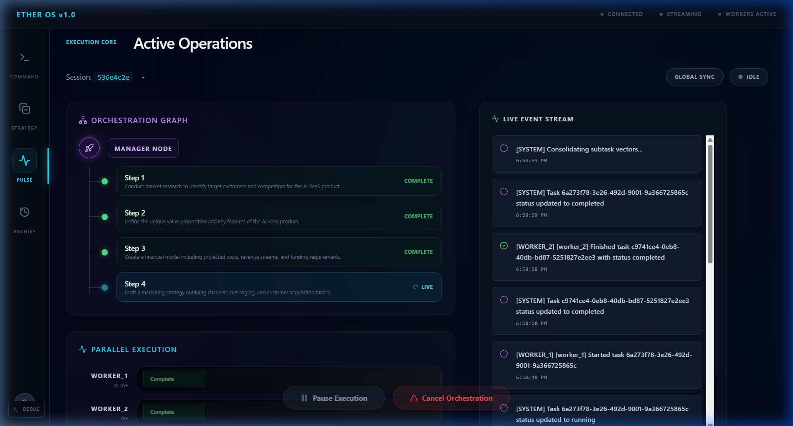
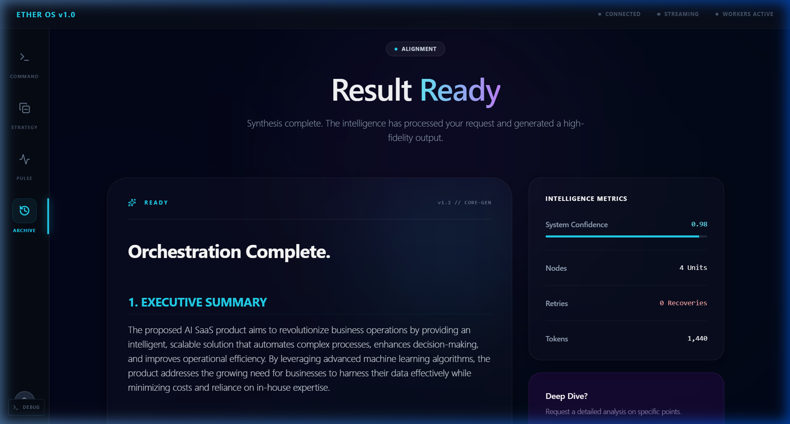

# Ether OS: The Sovereign Agentic Orchestration Layer 🌌

**Transform complex objectives into high-fidelity intelligence via hierarchical multi-agent clusters.**

## 🚀 Live Demo

🔗 https://ether-os.vercel.app

---

Ether OS is a premium, production-grade multi-agent system designed for recursive task decomposition and parallel execution. Unlike flat LLM wrappers, Ether OS utilizes a **Manager-Worker** architecture to break down massive prompts into atomic, executable units, providing real-time transparency through a low-latency SSE reasoning stream.

---

## ⚡ Why Ether OS?

Traditional AI interfaces are black boxes—you provide a prompt and wait for a single output. **Ether OS** flips the paradigm:

*   **Recursive Decomposition**: Your prompt isn't just answered; it’s architected. The Manager Node maps the "Mission Brief" into a strategy.
*   **Massive Parallelism**: Workers execute non-dependent subtasks simultaneously, slashing time-to-result by up to 70%.
*   **Live Pulse Streaming**: Watch the collective "thinking" process. Every tool call, reasoning step, and partial result is streamed via a real-time event bus.
*   **Executive Synthesis**: Raw data is useless. Ether OS ends every session with a "Strategic Brief"—a high-fidelity intelligence report formatted for immediate action.

---

## 🏗 System Architecture

Ether OS follows a strict decoupled architecture, separating the **Strategic Layer** (Manager) from the **Tactical Layer** (Workers).

### The "Sovereign" Workflow
1.  **Ingestion**: The user provides a high-level objective.
2.  **Decomposition**: The Manager AI (Senior Staff persona) analyzes the objective and identifies critical "vectors".
3.  **Parallel Dispatch**: Tasks are dispatched to worker pools. If one worker fails, the system self-heals or retries.
4.  **Real-Time Feedback**: Every thought is emitted to the UI via Server-Sent Events (SSE).
5.  **Final Brief**: A separate synthesis engine aggregates all worker output into a structured markdown report.

---

## ✨ Categorized Features

### 🧠 Orchestration & Intelligence
*   **Staff Executive Persona**: The Manager uses a highly refined prompt architecture to act as a project lead.
*   **Recursive Task Mapping**: High-level goals are broken into specific, manageable subtasks.
*   **Dynamic Retries**: Automatic error handling and task rescheduling for resilient execution.

### ⚡ Real-Time Streaming
*   **Live Pulse Engine**: Sub-second feedback loop showing every reasoning step.
*   **Visual Execution Graph**: Real-time status indicators (Planning, Executing, Synthesizing).
*   **Live Trace**: View raw logs and execution latency for every worker in real-time.

### 🛠 Operational Control
*   **Global Kill-Switch**: Immediate cancellation of all parallel processes with state persistence.
*   **Stateful Persistence**: SQLite backend ensures that execution state is preserved even if the frontend disconnects.
*   **Tool Agnostic**: Extensible architecture to add web search, code execution, or custom APIs.

---

## 🧠 Multi-Agent Intelligence Model

Ether OS treats LLMs as **compute units**, not just chat bots. 

| Layer | Responsibility | Model Preference |
| :--- | :--- | :--- |
| **Manager** | Planning, Decomposition, Delegation | GPT-4o / Claude 3.5 Sonnet |
| **Worker** | Tool use, Specific reasoning, Atomic execution | GPT-4o-mini / Llama 3 |
| **Synthesizer**| Narrative structure, Brief generation | GPT-4o (High Temperature) |

This tiered approach optimizes for both **intelligence (Manager)** and **speed/cost (Workers)**.

---

## 🚀 Performance & Design Principles

*   **Async-First**: Built entirely on Python's `asyncio` for non-blocking I/O and parallel execution.
*   **Low-Latency SSE**: Custom event-bus logic ensures that logs are pushed to the UI without the overhead of WebSockets.
*   **Neural Aesthetics**: The UI is designed with a "Glassmorphism" aesthetic—prioritizing focus, transparency, and data density.
*   **Production Stability**: Strict state management ensures that a task is either "Done", "Failed", or "Aborted"—never "Lost".

---

## 💻 Modern Tech Stack

| Frontend | Backend | Infra & DevOps |
| :--- | :--- | :--- |
| **Next.js 14** (App Router) | **FastAPI** (Python 3.10+) | **Railway** (Backend & DB) |
| **Zustand** (State Persistence) | **SQLAlchemy** (ORM) | **Vercel** (Edge Delivery) |
| **Framer Motion** (Motion UI) | **Uvicorn** (ASGI Server) | **SQLite/Postgres** (Relational) |
| **TailwindCSS** (Custom Tokens)| **OpenRouter** (Multi-LLM) | **SSE** (Real-time Pipeline) |

---

## 📸 Interface Preview

  
  ### Manager Orchestration View
  
  *Strategic task decomposition by Manager Node*

  ### Real-Time Execution Trace
  
  *Real-time multi-agent execution stream*

  ### Strategic Brief (Result)
  
  *Final intelligence synthesis output*

---

## 🏗 Deployment Architecture

Ether OS is designed for a **Distributed Proxy Model**:

1.  **Frontend (Vercel)**: Next.js is deployed to the edge for maximum responsiveness.
2.  **Backend (Railway)**: The FastAPI server handles heavy-lift orchestration and long-running async tasks.
3.  **Secure Proxying**: The frontend communicates with the backend via a dedicated `NEXT_PUBLIC_BACKEND_URL` proxy, ensuring API keys never touch the client-side.

### Production Readiness
*   **Stateless Frontend**: All mission state is managed on the backend.
*   **Connection Resilience**: SSE stream automatically reconnects and resumes data flow.
*   **Scalable Worker Pool**: Logic is optimized to scale worker concurrency based on server resources.

---

## 📅 Future Roadmap

- [ ] **Agent Marketplace**: Template gallery for specialized worker personas.
- [ ] **Memory Persistence**: Long-term session history and vector memory.
- [ ] **Custom Tool SDK**: Enable developers to plug in their own worker tools.
- [ ] **Mobile Native**: A dedicated PWA experience for intelligence-on-the-go.

---

## ⚖ License

MIT License. Developed by the **Antigravity Team** at DeepMind Advanced Agentic Coding. 🌌
