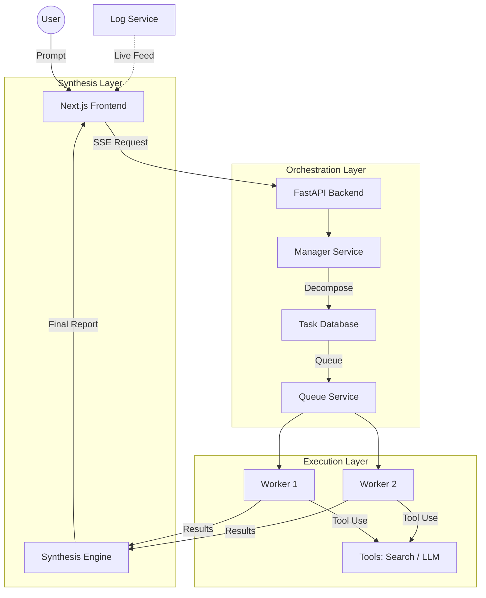

# Ether OS: Intelligence Synthesis Engine 🌌

**Ether OS** is a premium, multi-agent orchestration system designed to transform complex user prompts into structured, actionable intelligence. It utilizes a hierarchical agent architecture where a central **Manager Node** plans tasks and delegates them to parallel **Worker Units**, providing real-time transparency via a live event stream.

---

## 🛠 Features

- **Hierarchical Orchestration**: Uses a Staff Executive Analyst (Manager) to decompose high-level objectives into specific subtasks.
- **Parallel Execution**: Multiple autonomous workers execute subtasks concurrently using diverse tools (LLM reasoning, Web Search, etc.).
- **Live Pulse Stream**: Real-time visualization of the collective "thinking" process via Server-Sent Events (SSE).
- **Dynamic Orchestration Graph**: visual trail of task status, worker assignment, and execution latency.
- **Executive Synthesis**: Aggregates raw worker outputs into a world-class strategic brief including Executive Summaries, Strategic Insights, and Execution Roadmaps.
- **Full Operational Control**: Global Pause, Resume, and Cancel orchestration capabilities with immediate system feedback.

---

## 🏗 Architecture



---

## 💻 Tech Stack

### Frontend
- **Framework**: Next.js 14 (App Router)
- **State Management**: Zustand (with Persistence)
- **Animations**: Framer Motion
- **Styling**: Tailored Vanilla CSS + TailwindCSS (Glassmorphism & Neural Aesthetics)
- **Icons**: Lucide React
- **Streaming**: Native EventSource / ReadableStream API

### Backend
- **Framework**: FastAPI (Python 3.10+)
- **Server**: Uvicorn (ASGI)
- **Database**: SQLAlchemy + SQLite (Local state tracking)
- **AI Engine**: OpenAI/OpenRouter (Mistral & GPT models)
- **Concurrency**: `asyncio` for parallel task management

---

## 🚀 Getting Started

### 1. Prerequisites
- Node.js (v18+)
- Python (v3.10+)
- OpenAI/OpenRouter API Key

### 2. Backend Setup
```bash
cd backend
python -m venv venv
source venv/bin/activate  # On Windows: venv\Scripts\activate
pip install -r requirements.txt
```
Create a `.env` file in the `backend` folder:
```env
OPENAI_API_KEY=your_key_here
OPENAI_BASE_URL=https://openrouter.ai/api/v1  # Optional
```
Run the server:
```bash
python main.py
```

### 3. Frontend Setup
```bash
cd frontend
npm install
```
Run the development server:
```bash
npm run dev
```
Open [http://localhost:3000](http://localhost:3000) to access the Ether OS interface.

---

## 🕹 Usage

1. **Mission Briefing**: Enter a complex objective (e.g., "Plan a 12-month expansion strategy for a green hydrogen plant in Norway").
2. **Orchestration**: Watch the Manager Node identify vectors and spawn workers.
3. **Control**: Use the floating control dock to **Pause** or **Cancel** the operation if alignment drifts.
4. **Synthesis**: Review the high-fidelity Intelligence Synthesis, copy the results, or download the trace.

---

## 🛡 Recent Updates
- **[2024.04.16] Cancel Protocol Fix**: Hardened the cancellation logic to ensure immediate worker shutdown and persistent "Aborted" state across the SSE stream and Result UI.
- **[2024.04.14] synthesis Engine**: Upgraded the backend to utilize the "Executive Intelligence Analyst" persona for higher-quality strategic narratives.

---

## ⚖ License
MIT License - Developed by DeepMind Advanced Agentic Coding Team (Antigravity).
